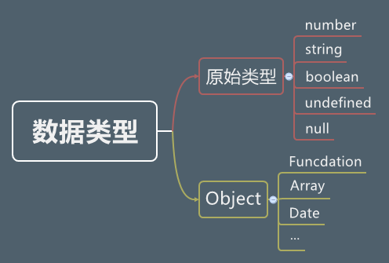

### JavaScript学习笔记00

@(JavaScript)

----------

 > JavaScript 是一种弱类型的语言。

 [TOC]
### 类型

 

> - JavaScript 中的变量是没有类型，值有才类型，变量持有值的类型，类型定义了值的行为特征。
> - 对变量执行`typeof`操作时，得到的是该变量持有的值的类型。
> - `typeof`运算符总会返回一个字符串。
``` javascript
typeof typeof 42; // "string"
```
*`typeof 42` 首先返回一个字符串 `"number"`，然后`typeof "number"`,返回 `"string"`*。
> 在作用域中声明但还没有赋值的变量为`undefined`，是值的一种，没有在作用域中声明过的变量为`undeclared`，两个不可混为一谈。

###值
#### 数组与字符串
> 对数组声明后即可向其加入值，无需预先指定数组大小。
``` javascript
var arr = [ ];
arr.length; // 0
a[0] = 1;
a[1] = "2";
a[2] = [3];
a.length; // 3
```
> 数组不仅可以通过数字下标作为索引，也可以用包含字符串键值和属性，但这些不计入数组长度内。
> 
``` javascript
var arr = [ ];

a[0] = "2";
a[1] = 20;
arr.length; // 
a["apple"] = 1;
a.length; // 2
a["apple"] = 1;
a.apple = 1;
```
> 如果字符串键值可以被强制类型转换为十进制数字的话，依旧会被当做数字索引来处理。
``` javascript
var arr = [ ];
a["13"] = 22;
a.lenth; // 14
```
> 不建议在数组中加入字符串作为下标，建议使用数字下标。
> JavaScript 中的字符串是不可变的，而数组可变。字符串不可变是指字符串的成员函数不会改变其原始值，而是创建并返回一个新的字符串。

字符串反转：
``` javascript
var chars = "ufo";
var reverseChars = chars.split("").reverse().join("")//ofu
```

*`chars.split("")`将字符串转换为字符数组，`.reverse()`将数组中的字符逆序排序，`.join("")`将数组中的字符拼接回字符串*。

#### 数字
> JavaScript 中只有一种数值类型：`number`(数字)，包括十进制的小数和没有小数的整数。
#####数字语法
> 数字前面的0和小数点后最后面的0可以省略,但不建议这样写。
``` javascript
var num = .42;
var num = 42.;
```
> tofixed(..),可以指定小数部分显示的位数，输出结果为字符串形式。
>  toprecision(..)，用来指定有效位数。
``` javascript
var num = 13.1341;
num.tofixed(3); // "13.134"
num.toprecision(4); // "13.13"
(42).tofixed(3); // "42.000"
42..tofixed(3); // "42.000"  罕见
0.42.tofixed(3); // "0.420" 罕见
42.tofixed(3); // 语法错误，相当于(42)tofixed(3);
42 .tofixed(3); // "42.000"  不推荐
```
> 进制，从ES6开始采用严格模式(strict mode)，为了代码的易读性，建议使用小写的0b、0o、0x代表二进制、八进制和十六进制。
##### 整数检测
 检测一个数是否为整数
``` javascript
Number.isInteger(42.0); // true
```
 检测一个数是否为安全的整数(最大值为 Number.MAX_SAFE_NTEGER == Math.pow(2,53)-1 )
```javascript
Number.isSafeInteger(Math.pow(2,53)-1); // true
```
####  特殊数值
##### 不是值的值
>- undefined 数据类型只有一个的值，即 undefined，表示没有值、从未赋值，通过void 运算符即可得到该值。
> 
>-  null 类型也只有一个值，即 null，表示空值，目前没有值。
> 
> 两者常用来表示"空值"或"不是值"的值。
##### 特殊的数字
> - 不是数字的数字`NaN(not a number)`，也可理解为"无效数值"、"坏数值"。`NaN` 是一个特殊值，它和自身不相等，是唯一一个非自反值(即`x===x`不成立)，而`NaN != NaN`为 `true`。“不是数字的数字”仍然是数字类型。

> 如果需要判断一个值是否是`NaN`，建议使用`Number.isNaN(..)`。
``` javascript
if(!Number.isNaN){
Number.isNaN = function(n) {
return n !== n;
};
}
var a = 2 / "foo";
var b = "foo";
Number.isNaN( a ); // true
```

> - 无穷数,相对于 `Infinity`， `Number.MAX_ VALUE + Math.pow(2, 969)` 与 `Number.MAX_VALUE` 更为接近，因此它被“向下取整”（ round down）；而 `Number.MAX_VALUE + Math.pow(2, 970)` 与 `Infinity` 更为接近，所以它被“向上取整”（ round up）。

``` javascript
var a = 1 / 0; // Infinity
var b = -1 / 0; // -Infinity
```
>- 零值，加法和减法运算不会得到负零（ negative zero）。根据规范，对负零进行字符串化会返回 "0"，将其从字符串转换为数字，得到的结果是准确的。`-0==0`，`-0===0`，都为`true`，ES6 中新加入了一个工具方法 Object.is(..) 来判断两个值是否绝对相等。
``` javascript
var a = 0 / -3; // -0
var b = 2/"foo" ; // NaN
// 但是规范定义的返回结果是这样！
a.toString(); // "0"
a + ""; // "0"
String( a ); // "0"
JSON.stringify( a ); // "0"

+"-0"; // -0
Number( "-0" ); // -0
JSON.parse( "-0" ); // -0
	
Object.is( b, NaN ); // true
Object.is( a, -0 ); // true
Object.is( a, 0 ); // false
```
#### 值和引用
> 简单值（即标量基本类型值， scalar primitive） 总是通过值复制的方式来赋值 / 传递，包括 `null`、 `undefined`、字符串、数字、布尔和 ES6 中的 `symbol`。
> 
复合值（ compound value）——对象（包括数组和封装对象）和函数，则总是通过引用复制的方式来赋值 / 传递。

>引用指向的是值本身而非变量，所以一个引用无法更改另一个引用的指向。我们无法自行决定用值复制还是引用复制，一切都由值的类型来决定。

>`Arr.slice()` 不带参数会返回当前数组的一个浅复本（ shallow copy）。由于传递给函数的是指向该复本的引用，所以 `foo(Arr.slice(..))` 中的操作不会影响 `Arr` 指向的数组。
>

``` javascript
var a = [1,2,3];
var b = a;
a; // [1,2,3]
b; // [1,2,3]
// 然后
b = [4,5,6];
a; // [1,2,3]
b; // [4,5,6]
```
> 标量基本类型值是不可更改的（字符串和布尔也是如此）。如果一个数字对象的标 量基本类型值是 2，那么该值就不能更改，除非创建一个包含新值的数字对象。
``` javascript
function foo(x) {
x = x + 1;
x; // 3
}
var a = 2;
var b = new Number( a ); // Object(a)也一样
foo( b );
console.log( b ); // 是2，不是3

function foo(wrapper) {
wrapper.a = 42;
}
var obj = {
a: 2
};
foo( obj );
obj.a; // 42
```
####  隐式转换
``` javascript
var num = "32"+32;// "3232"
var num = "32"-32;// 0

	    
“1.23” == 1.23
0 == false
null == undefined
new Object() == new Object()
[1, 2] == [1, 2]
/*类型不同，返回false
类型相同*/
NaN ≠ NaN
new Object ≠ new Object
null === null
undefined === undefined	    
```
### 


 